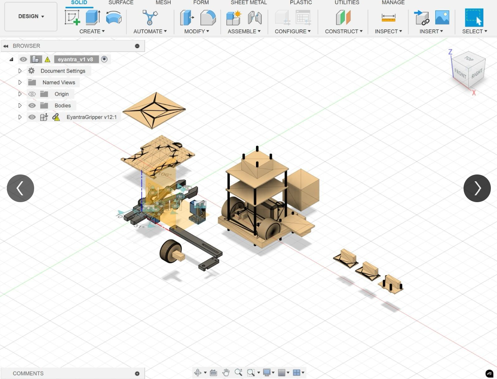
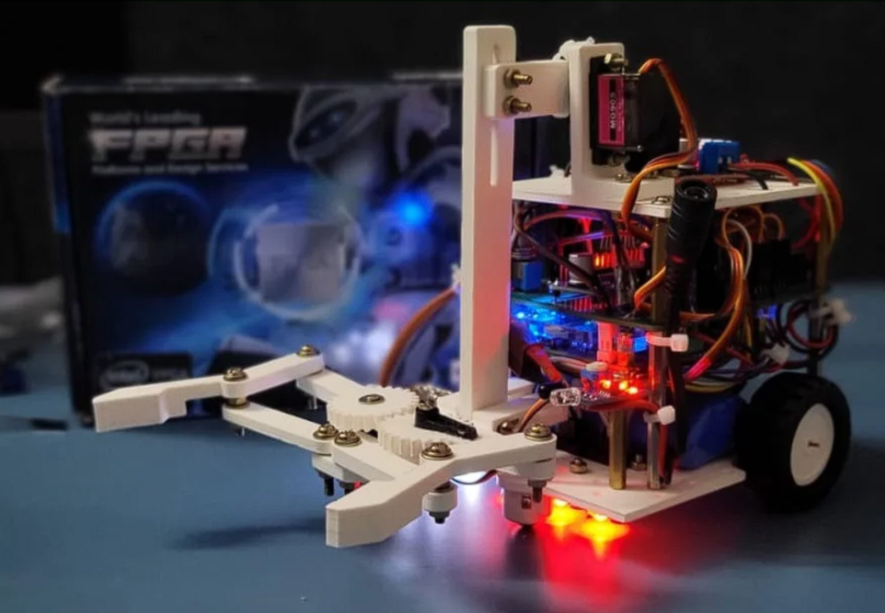
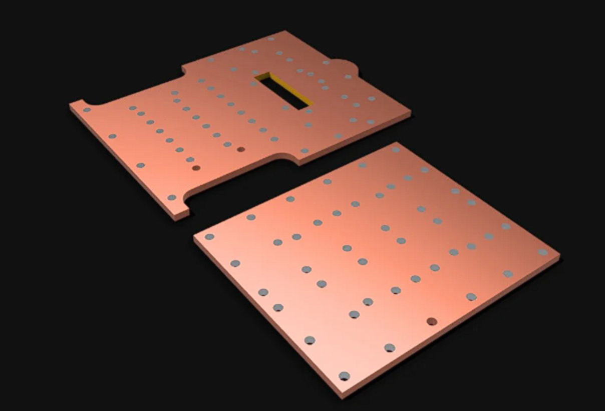
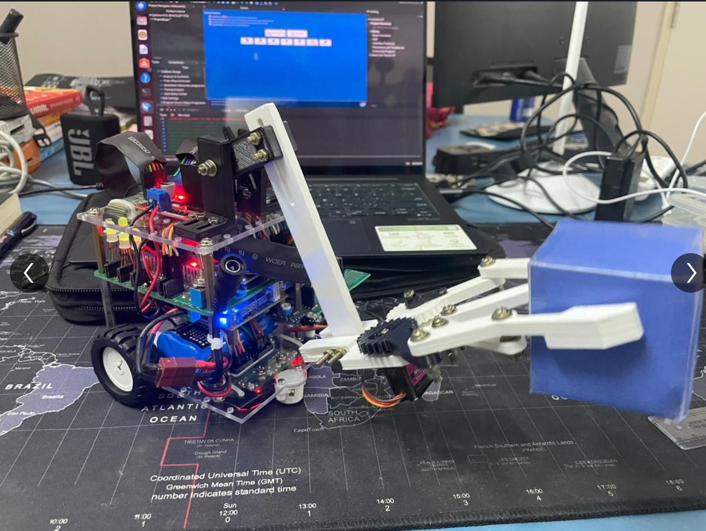
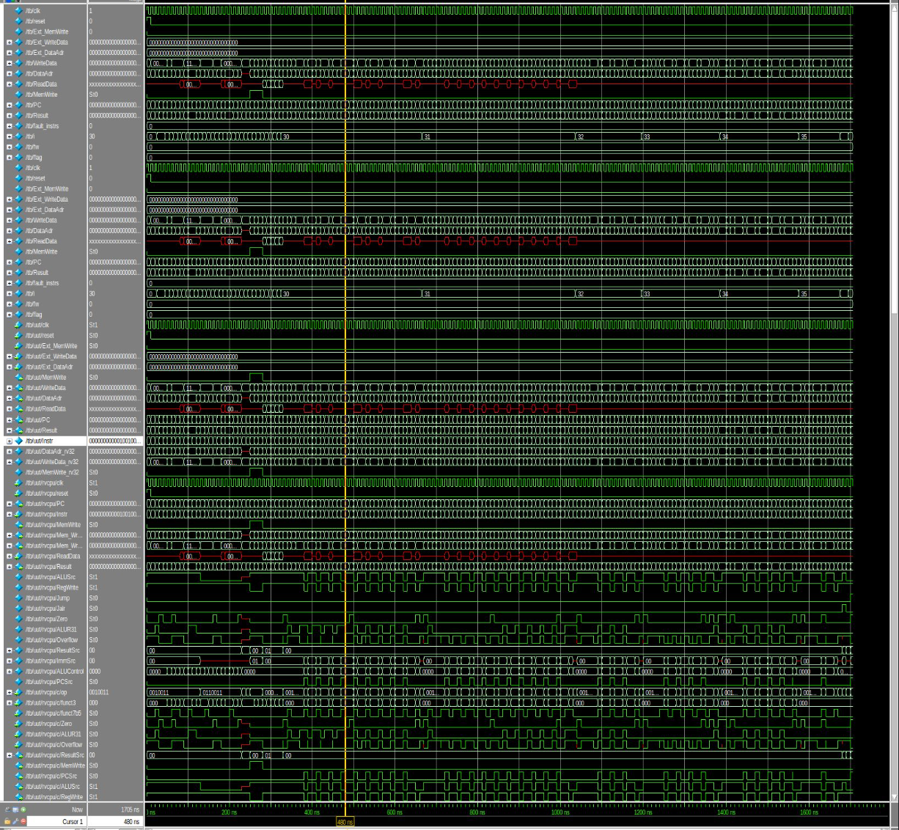
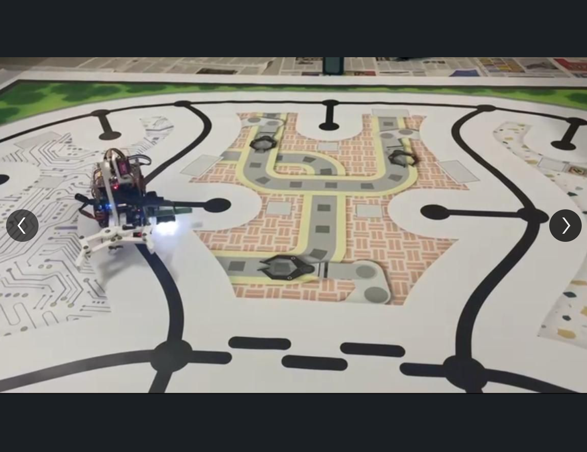

# Ecomender Bot: e-Yantra 2024

Done for a robotics competition hosted by IIT Bombay, for more information check our [report](report.pdf).

FPGA Used: Altera Cyclone IV E De0 Nano Development Board.
EDA Tool Used: Intel Quartus Prime Lite, ModelSim, Fusion360, AutoCad.

### What we built?

A line follower robot with a gripper to grip specific sized boxes which work as payload, the robot is controlled by **a single cycled 32-bit RISCV processor** with the base extension set RV32I, apart from we worked on our own verilog modules with the help of the boilerplate codes given to us.

1. PWM Module - To control the speed of the motors using our motor driver, which took inputs as PWM signals, To control our servos.
2. Frequency Scaler Module - Used with everyother module to scale down the clock frequency of our processor as use it to all other modules.
3. UART Module - To send and receive ASCII based coded messages using a HC05 bluetooth module.
4. Wrapper Color Sensor Module - To use with our TCS3200 color sensor module.

To read more on the Processor design check this [repo](https://github.com/Sreeram-Ramesh/riscv-single-cycle-core.git) of mine.

### Results:

| Development | Endproduct |
| :---: | :---: |
|    **Prototyping on Fusion360** |    **First Iteration Build** |
|    **Chassis Design on AutoCad** |    **Final Iteration Build** |
|    **Our Processor Life Signals** |    **Bot in test run** |
